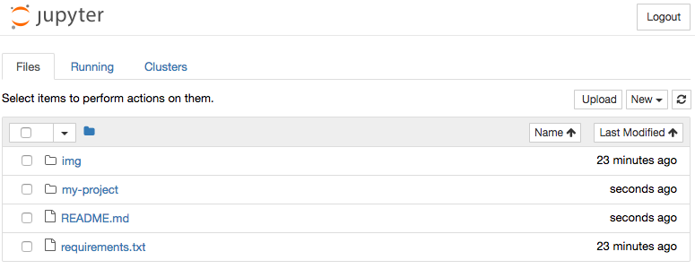

# Jupyter Notebooks and Virtual Environments

Run one `jupyter notebook` server per user, but allow notebooks to be created in multiple Python virtual environments.

These instructions assume a shell environment similar to:

```text
WORKON_HOME=$HOME/.virtualenvs
PROJECT_HOME=$HOME/Code
```

## Install Jupyter

**Note**: If you're using the Anaconda distribution of Python, you can probably skip this step, and just run `jupyter notebook` in the default environment.

Install Jupyter and useful tools like Pandas into a new virtual environment: 

```text
$ python3 -m venv $WORKON_HOME/jupyter-venv
$ source $WORKON_HOME/jupyter-venv/bin/activate
(jupyter-venv)$ cd $PROJECT_HOME
(jupyter-venv)$ git clone https://github.com/bhrutledge/jupyter-venv.git
(jupyter-venv)$ cd jupyter-venv
(jupyter-venv)$ pip install -r requirements.txt
(jupyter-venv)$ jupyter notebook
```

You should now see the Jupyter Notebook server in your web browser, and you can create notebooks using `New > Python 3`:


## Add virtual environment kernels

In a new shell session, switch to one of your virtual environments, and install an IPython kernel:

```text
$ source $WORKON_HOME/my-project/bin/activate

# The `ipykernel` package should be added to this environment's requirements.txt
(my-project)$ pip install ipykernel

# Using Bash parameter expansion to get the virtual environment name
(my-project)$ VENV=${VIRTUAL_ENV##*/}
(my-project)$ python -m ipykernel install --user --name="$VENV" --display-name="Python ($VENV)"
```

On macOs, this will create a Jupyter kernel spec in `$HOME/Library/Jupyter/kernels/my-project`. You can edit `kernel.json` in that directory to set environment variables or pass additional arguments to `python`.


## Location of notebooks

By default, new notebooks are created at the root directory of the notebook server (`~/Code/jupyter-venv` in this example). At the very least, I recommend using `New > Folder` to create a sub-directory with the name of your virtual environment (`my-project` in this example), and creating notebooks for that environment in that directory.

However, this means that notebooks will still live in the `jupyter-venv` repo. If you'd prefer they live in the `my-project` repo, you can create a symbolic link:

```text
(my-project)$ VENV=${VIRTUAL_ENV##*/}
(my-project)$ mkdir "$PROJECT_HOME/$VENV/jupyter-notebooks"
(my-project)$ ln -s "$PROJECT_HOME/$VENV/jupyter-notebooks" "$PROJECT_HOME/jupyter-venv/$VENV"
(my-project)$ echo $VENV >> "$PROJECT_HOME/jupyter-venv/.gitignore"
```


## Creating notebooks inside a virtual environment

Now, reload your Jupyter Notebook browser tab, and you should see the sub-directory or symbolic link that you created:



Click `my-project`, and then use `New > Python (my-project)` to create a notebook:


You can now use all of the packages that installed in the `my-project` environment. It also means that you can't use the packages in the `jupyter-venv` environment, used by the default `Python 3` kernel. So, if you want to use packages like Pandas or matplotlib, you'll need to `pip install` them in the `my-project` environment (ideally by adding them to its `requirements.txt`).

## Reference

* [Using a virtualenv in an IPython notebook](http://help.pythonanywhere.com/pages/IPythonNotebookVirtualenvs)
* [Installing the IPython kernel](https://ipython.readthedocs.io/en/latest/install/kernel_install.html)
* [Making kernels for Jupyter](https://jupyter-client.readthedocs.io/en/latest/kernels.html)


## TODO

- Rationale for not running `jupyter notebook` in project's virtual environment
- Shell script for adding kernel and symlinking notebook directory
